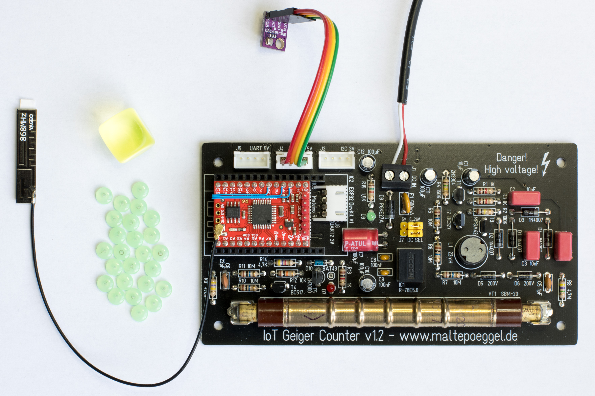
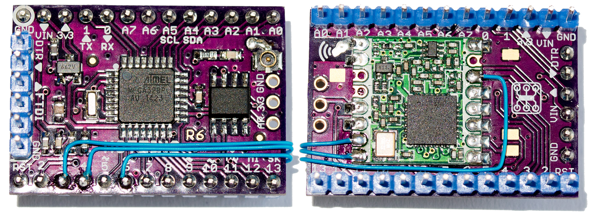

# IoT Geiger Counter LoRaWAN Firmware

This repository contains the firmware for a radiation monitor / weather station based on my IoT Geiger Counter board and a Moteino R6.

The measurement data will be transmitted via LoRaWAN which can be used everywhere where no WiFi is available and a high range (1 km) to the base station (gateway) is required. Due to the relatively low power consumption of about 15mA, solar / battery operation is also possible.

A JavaScript payload decoder tested with TheThingsNetwork v3 and ChirpStack v4 is provided.

## Required parts

Besides of the IoT Geiger Counter board, the following components are needed:

- [Moteino R6](https://lowpowerlab.com/guide/moteino/) (8MHz or 16MHz[^1] variant, the former requires the 3.3V LDO to be installed)
- RFM95W LoRa Module
- MB85RS64T SPI FRAM (strongly recommended for LoRaWAN session data storage)
- BME280 temperature, humidity, barometric pressure sensor (optional)
- u.fl jack & 868MHz LoRa antenna
- USB serial adapter with 5V VCC and 3.3V logic level for programming ([Moteino FTDI Adapter](https://lowpowerlab.com/shop/product/90), [Adafruit FTDI Friend](https://www.adafruit.com/product/284) or my [Serial Adapter](https://github.com/MalteP/Serial-Adapter))
- Atmel AVR ISP for bootloader burning (optional, 3.3V, USBASP or similar)

[^1]: 16MHz at 3.3V is not within the ATMega328P specification and thus not recommended

## Implementation

The processor on the Moteino R6 is an Arduino compatible Atmel ATMega328P. The project therefore utilizes the popular MCCI Arduino LMIC library for LoRa. For easy compilation and deployment, the PlatformIO toolchain is used.

The LoRaWAN implementation supports OTAA and ABP. Session data (e.g. session keys, frame counter) will be stored in the SPI FRAM chip from time to time. That is done immediately after joining the network and also after each third data packet has been sent. The advantage of FRAM over flash memory is a much higher number of write cycles, but it is still a good idea to limit them a little bit.

To count the pulses of the GM tube, D5 (Timer 1) is used. Since Timer 0 is occupied by the Arduino libraries, Timer 2 serves as clock source for the gate time. By counting the overflows, a 60s interval can be generated to read and reset the current counter value.

Due to restrictions of the 868MHz ISM band, the transmission time per hour is limited. To meet these Duty Cycle requirements, data is collected over a user-defined interval, and an average CPM value is calculated and sent.

If a BME280 sensor is connected, temperature, humidity and barometric pressure data is also included.

The transmission interval can be set from 5 to 60 minutes. It is possible to adjust it remotely by sending an downlink packet.

## Preparing the hardware

Three additional wires are needed to connect the pins DIO0 (Tx/RxDone), DIO1 (RxTimeout) and DIO2 (TimeoutFSK) to the GPIOs D2, D3 and D4 as shown in the picture below.

## Software prerequisites

Please follow the guides on platformio.org to either install [PlatformIO core](https://platformio.org/install/cli) (for console operation) or [VS Code & PlatformIO](https://platformio.org/install/ide) (IDE). Then clone this repository and change to the correct directory.

## Burning the bootloader

As the DualOptiboot bootloader did not work in my setup, I switched to Urboot, the default bootloader of the MiniCore Arduino framework used. This bootloader is also much smaller, leaving more flash memory available for the firmware. To flash it simply connect MISO, MOSI, SCK, +3.3V and GND of your USBASP to the Moteino. Please make sure the programmer is set to 3.3V voltage, as the RFM95W is *not* 5V tolerant! If the RFM95W and FRAM chip are already soldered in, you might need pull-up resistors on the NSS and /CS lines (D10, D8) as well. After that, just execute "pio run -t bootloader -e isp8mhz" (or isp16mhz) to program bootloader and fusebits.

## Configuring the LoRaWAN keys & network stack

Copy the file [src/config.h.example](src/config.h.example) to src/config.h. Then uncomment either USE_OTAA or USE_ABP, create a new device on your LoRaWAN server and fill in the initial session data in config.h as described therein. You can find the required payload decoder in [docs/payload-decoder.js](docs/payload-decoder.js).

## Flashing the firmware

When everything is configured, simply plug the USB serial adapter into your Moteino. Then execute "pio run -t upload -e moteino8mhz" (or moteino16mhz) to program the firmware.

You might check the serial console for log messages of your IoT Geiger Counter by using the command "pio device monitor". The network will be joined immediately after power up. Measurement values will be transmitted every five minutes.

Once the LoRaWAN activation is completed, the session data is stored in FRAM and recovered at boot. A hash value of config.h is included to detect configuration changes and invalidate the current session, forcing the device to re-activate.

## Status LED

The LED on the moteino will light up if a packet is being sent. It will blink if the OTAA activation fails.

## Remote configuration

The interval may be adjusted at runtime by transmitting a downlink packet. To change it, just send an 8-bit unsigned integer value representing the desired time span in minutes to fPort 1. For example, the hexadecimal value 0F would result in a 15 minute interval. The option to send such a packet can be found in TTN under "Messaging" or in Chirpstack under "Queue".

## Further information

https://www.maltepoeggel.de/?site=iotgeiger

https://lowpowerlab.com/guide/diy-moteino/

https://github.com/LowPowerLab/Moteino

## License

This firmware is released under the terms of the MIT license, see [LICENSE](LICENSE) file for details.